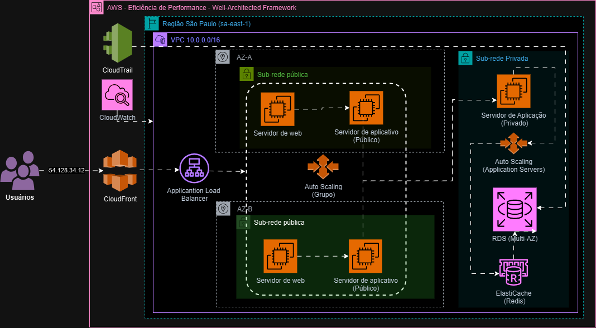
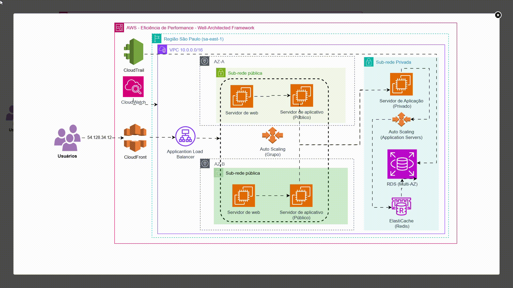

# Desafio de Arquitetura AWS - Eficiência de Performance

Este projeto apresenta uma arquitetura AWS de três camadas otimizada para performance, utilizando os princípios do pilar de Eficiência de Performance do AWS Well-Architected Framework. O objetivo é otimizar uma arquitetura existente, adicionando serviços e ajustes para maximizar a performance e a resiliência.

## Grupo 4 – EFICIÊNCIA DE PERFORMANCE

* Michael Jhon Rodrigues Costa
* Gabriele da Conceição Jesus
* José Tadeu Daher
* Guilherme Thomas
* Affonso Souza
* Victor Ramos Andrade Callegari
* Tiago Silva Souza
* Luciano Alves Teles
* Artur de Souza Costa
* Diogo De Assis Luna Da Silva

## Arquitetura Proposta

### Diagrama Estático



### Diagrama Animado (GIF)




## Diagrama da Arquitetura (Mermaid - Opcional)

```mermaid
graph LR
    Usuarios((Usuários)) --> CloudFront[CloudFront] --> ALB[Application Load Balancer]

    subgraph VPC 10.0.0.0/16
        subgraph Sub-rede pública
            ALB --> ASWeb[Auto Scaling (Web Servers)]
            ASWeb --> AppPub[Servidor de aplicativo (Público)]
        end

        subgraph Sub-rede privada
            AppPub --> AppPriv[Servidor de aplicativo (Privado)]
            AppPriv --> ASApp[Auto Scaling (Application Servers)]
            ASApp --> ElastiCache[ElastiCache (Redis)]
            ElastiCache --> RDS[RDS (Multi-AZ)]
        end
    end

    CloudTrail[CloudTrail] --> RDS
    CloudWatch[CloudWatch] --> ALB
    CloudWatch --> ASWeb
    CloudWatch --> AppPub
    CloudWatch --> AppPriv
    CloudWatch --> ASApp
    CloudWatch --> ElastiCache
    CloudWatch --> RDS
```

## Justificativa das Alterações

As seguintes alterações foram implementadas para otimizar a performance:

* **CloudFront:** Implementado como CDN para reduzir a latência e melhorar os tempos de carregamento.
* **Application Load Balancer (ALB):** Distribui o tráfego entre os servidores web em múltiplas zonas de disponibilidade (AZs).
* **Auto Scaling (Web Servers e Application Servers):** Permite que a arquitetura escale automaticamente com base na demanda.
* **ElastiCache (Redis):** Cache em memória para dados frequentemente acessados, reduzindo a carga no banco de dados.
* **RDS (Multi-AZ):** Garante alta disponibilidade e durabilidade do banco de dados.
* **CloudWatch:** Monitora todos os componentes da arquitetura.
* **CloudTrail:**  Registra as chamadas de API feitas à infraestrutura.
* **Separação de Sub-redes (Pública e Privada):** Aumenta a segurança e o isolamento dos recursos.

## Arquivos do Projeto

* `Desafio Well-Architected Framework - Resolucao Designer Eficiência de Performance - WAF.drawio`: Arquivo do diagrama no formato diagrams.net (editável).
* `Desafio Well-Architected Framework - Resolucao Designer Eficiencia de Performance - WAF.html`: Arquivo do diagrama no formato html.
* `Desafio Well-Architected Framework - Resolucao Designer Eficiencia de Performance - WAF.gif`: Arquivo GIF com a animação do fluxo de dados.
* `Desafio Well-Architected Framework - Resolucao Designer Eficiência de Performance - WAF.png`: Arquivo de imagem estática do diagrama.
* `Desafio Well-Architected Framework.drawio`: Arquivo base do diagrama fornecido pelo professor.


## Próximos Passos (Opcional)

* Implementar a arquitetura usando CloudFormation ou Terraform.
* Realizar testes de performance e carga.
* Monitorar e otimizar a arquitetura com base nas métricas do CloudWatch.
